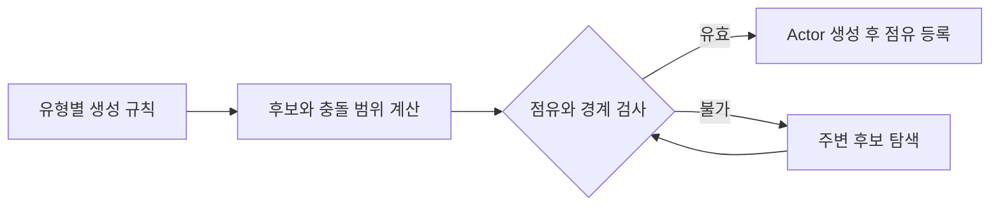

# 충돌 범위 기반 배치와 자원 재생성

## Issue

절차적으로 생성하는 오브젝트는 크기와 필요한 이동 여유가 서로 다릅니다. 중심점이 비어 있는지만 확인하면 실제 메시가 겹치거나 플레이어가 지나갈 공간을 막을 수 있습니다. 자원만 재생성할 때는 다른 오브젝트의 점유 상태를 유지해야 합니다.

## Solution

메시의 충돌 박스 또는 경계 크기를 기준으로 점유 범위를 계산하고, 유형별 여유 영역을 추가했습니다. 좌표 배열에는 유형별 점유 마스크를 기록하여 위치 후보의 전체 범위를 검사하도록 했습니다.

배치가 불가능한 후보는 주변 방향과 거리별 후보를 검사하여 대체 위치를 찾도록 했습니다. 이는 정해진 탐색 순서에서 처음 유효한 후보를 찾는 방식이며, 수학적으로 가장 가까운 위치를 보장하는 최적화 알고리즘은 아닙니다.

유형별 Generator는 무엇을 어떻게 생성할지 결정하고, 맵 생성 컴포넌트는 공통 공간 판정을 맡도록 했습니다. 자원 재생성에서는 자원 Actor와 해당 점유 마스크만 제거한 뒤 같은 생성 경로를 사용했습니다.

## Result

중심점이 아니라 오브젝트가 차지하는 범위로 배치를 검사하도록 했고, 유형별 생성 코드에서 같은 공간 검증을 사용하도록 했습니다. 라운드 전환에서는 다른 유형의 점유를 보존하면서 자원만 다시 배치하는 경계를 두었습니다.

이 구조에도 개선할 부분은 남아 있습니다. 촘촘한 좌표 배열은 메모리를 사용하며, 제한된 후보 탐색의 실패 처리와 생성 실패 시 재시도 상한은 더 엄격하게 다룰 필요가 있습니다. 모든 맵 크기와 배치 밀도에서 생성 성공을 보장하는 구조는 아닙니다.

## 코드 읽는 순서

1. [MapGeneratorComponent.cpp: 범위 계산, 점유 검사, 대체 위치](../Source/Source/ShootingStar/Private/MapGeneratorComponent.cpp)
2. [MapEnum.h: 유형 구분](../Source/Source/ShootingStar/Public/MapEnum.h)
3. [ObstacleGenerator.cpp: 장애물 생성](../Source/Source/ShootingStar/Private/ObstacleGenerator.cpp)
4. [ResourceGenerator.cpp: 자원 생성](../Source/Source/ShootingStar/Private/ResourceGenerator.cpp)

코드는 당시 스냅샷을 보존했습니다. 본 저장소 준비 과정에서 원본 게임 코드를 수정하거나 게임 실행 테스트를 새로 수행하지는 않았습니다.
